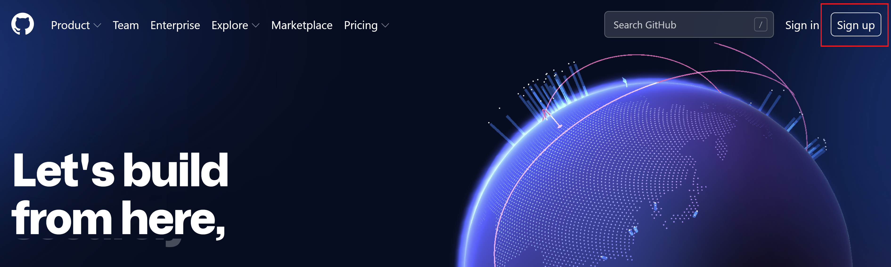
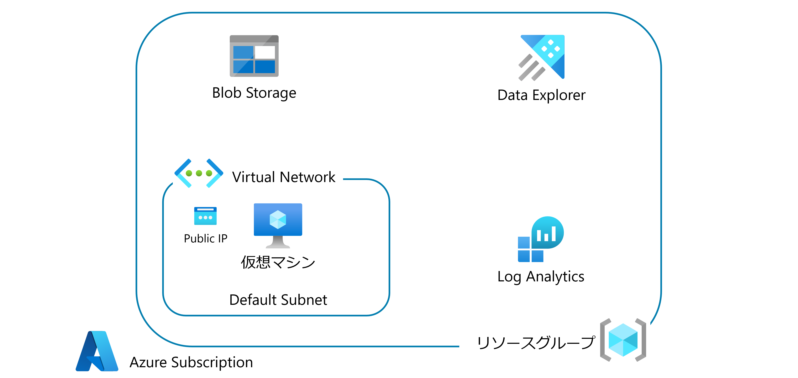

Log Analytics Hands-on lab  
July 2022

<br />

### 参考情報
- <a href="https://docs.microsoft.com/ja-jp/azure/cloud-adoption-framework/ready/azure-best-practices/resource-naming">名前付け規則を定義する</a>

- <a href="https://docs.microsoft.com/ja-jp/azure/cloud-adoption-framework/ready/azure-best-practices/resource-abbreviations">Azure リソースの種類に推奨される省略形</a>

<br />

## Azure リソースを展開する前に

以下の手順を行ってください。

- GitHub アカウントの作成

    - GitHub トップページ右上の `Sign up` から、アカウントを作成

    

- Git（[インストール方法](https://git-scm.com/book/ja/v2/%E4%BD%BF%E3%81%84%E5%A7%8B%E3%82%81%E3%82%8B-Git%E3%81%AE%E3%82%A4%E3%83%B3%E3%82%B9%E3%83%88%E3%83%BC%E3%83%AB)）

## リソースの展開

<br />

[](https://portal.azure.com/#create/Microsoft.Template/uri/https%3A%2F%2Fraw.githubusercontent.com%2Fkohei3110%2FLogAnalytics-Hands-on-Lab%2Fmaster%2Fazure%2Fazure-resources.json)

### パラメーター
- **logAnalyticsWorkspace**: Log Analytics ワークスペース名（長さ：4 ～ 63 / 有効な文字：英数字、およびハイフン）

- **clusterName**: Data Explorer クラスター名

- **storageAccountName**: ストレージアカウント名（一意に識別できる名前 / 長さ：3 ～ 24  / 有効な文字：英数字）

- **vmName**: 仮想マシン名（一意に識別できる名前 / 長さ：1 ～ 15  / 有効な文字：英数字およびハイフン）

- **adminUsername**: 仮想マシン管理者名

- **adminPassword**: 仮想マシン管理者パスワード（長さ：12 ～ 72 / 有効な文字：英数字、特殊記号 / 小文字を含む / 大文字を含む / 数字を含む / 特殊文字を含む ([\W_] に一致する正規表現)）

- **virtualNetworkName**: 仮想ネットワーク名（長さ：2 ～ 64 / 有効な文字：英数字、アンダースコア、ピリオド、およびハイフン）

- **addressPrefix**: 仮想ネットワーク IPv4 アドレス空間

- **pipName**: パブリックIPアドレス名

<br />

※事前にリソース グループの作成が必要です

※選択したリソース グループのリージョンにすべてのリソースが展開されます

<br />

### 展開後のリソース



<br />

## リポジトリのクローン

コマンドプロンプトから、ローカルPCの任意のディレクトリにて、以下を実行

```
git clone https://github.com/kohei3110/LogAnalytics-Hands-on-Lab.git
```