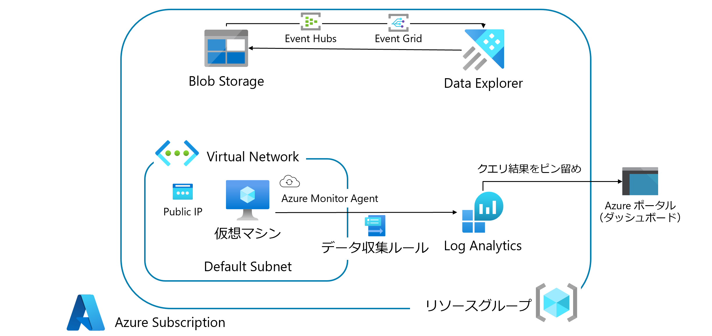

Log Analytics Hands-on lab
June 2022

<br />

### **Contents**

  * [**Contents**](#--contents--)
- [使用する環境](#------)
- [Exercise 1: Data Explorer を使った Blob コンテンツの分析](#exercise-1--data-explorer------blob---------)
  * [Task 1: Blob ストレージへのログファイルアップロード](#task-1--blob--------------------)
  * [Task 2: Data Explorer へのデータロード](#task-2--data-explorer---------)
  * [Task 3: Kusto クエリ実行](#task-3--kusto------)
  * [Task 4-1: Data Explorer へのデータロード自動化 ～Event Hubs / Event Grid～](#task-4-1--data-explorer--------------event-hubs---event-grid-)
- [Exercise 2: Azure Monitor エージェントを使った Log Analytics へのログ収集](#exercise-2--azure-monitor------------log-analytics-------)
  * [Task 1: データ収集ルール作成](#task-1------------)
  * [Task 2: Log Analytics ワークスペースへのクエリ実行](#task-2--log-analytics---------------)
  * [Task 3: クエリ結果のダッシュボードへのピン留め](#task-3---------------------)

## 使用する環境


<br />

## Exercise 1: Data Explorer を使った Blob コンテンツの分析


<br />

### Task 1: Blob ストレージへのログファイルアップロード

- Blob ストレージ（**logs**）に、`logs/sample.log` をアップロード

  

- SAS の生成 タブで以下を指定し、**SAS トークンおよび URL を生成**を選択

  - **署名方法**: アカウントキー
  - **署名キー**: キー１
  - **保存されているアクセスポリシー**: なし
  - **アクセス許可**: 読み取り
  - **開始日時と有効期限日時**: （既定）
  - **使用できる IP アドレス**: 空欄
  - **許可されるプロトコル**: HTTPSのみ

  

- 表示される **Blob SAS URL** をメモ帳にコピー＆ペースト

### Task 2: Data Explorer へのデータロード

- Data Explorer クラスターのデータベースページから、**データベースの追加**をクリック

  

- 以下を指定し、指定し、**作成**を選択

  - **データベース名**: db01
  - **保持期間（日数）**: 365
  - **キャッシュ期間（日数）**: 31

  

- Data Explorer クラスターの概要ページの **URI** をコピーし、ブラウザに貼り付けて表示

  

- データ タブの**新しいデータの取り込み**を選択

  

- 宛先 タブで以下を入力し、**次へ: ソース**を選択

  - **クラスター**: 既定のクラスター
  - **データベース**: db01
  - **テーブル**: 新しいテーブル（`tbllogs`）

- ソース タブで以下を入力し、**次へ: スキーマ**を選択

  - **ソースタイプ**: Blobから
  - **ソースへのリンク**: 先の手順でコピーした Blob SAS URL

  

- スキーマ タブで以下を入力し、**次へ: インジェストの開始**を選択

  - **圧縮の種類**: Uncompressed
  - **データフォーマット**: W3CLOGFILE
  - **マッピング名**: tbllogs_mapping（任意）

  

- データインジェストが完了したことを確認し、**閉じる**を選択

  

### Task 3: Kusto クエリ実行

- クエリ タブを選択し、作成した`db01`データベースをクリックし、以下のクエリを実行して結果が出力されることを確認

```
tbllogs
```

  

- サンプル Kusto クエリを実行

  - 2015年6月13日から2015年6月14日のログのうち、時刻が`00:00:00`に該当するデータの件数を取得

  ```
  tbllogs
  | where ["date"] >= datetime(2015-06-13) and ["date"] < datetime(2015-06-14)
  | where ["time"] == "00:00:00"
  | count
  ```

  - 2015年6月13日から2015年6月14日のログのうち、時刻が`00:00:00`に該当するデータを取得し、`s-ip`、`cs-method`、`cs-url-stem` のみ出力

  ```
  tbllogs
  | where ["date"] >= datetime(2015-06-13) and ["date"] < datetime(2015-06-14)
  | where ["time"] == "00:00:00"
  | project ["s-ip"], ["cs-method"], ["cs-url-stem"]
  ```

  - `tbllogs` テーブルから１件のみ取得し、`s-ip`、`cs-url-stem` のみ出力

  ```
  tbllogs
  | take 1
  | project ["s-ip"], ["cs-url-stem"]
  ```

  - 日付降順に２件取得し、`date`、`s-ip`、`cs-url-stem` のみ出力

  ```
  tbllogs
  | top 2 by ["date"] desc
  | project ["date"], ["s-ip"], ["cs-url-stem"]
  ```

  - `cs_User-Agent_` 列と`hoge`列を結合した`cs_User-Agent_hoge`列（カスタム列）を作成

  ```
  tbllogs
  | extend ['cs_User-Agent_hoge'] = strcat(['cs_User-Agent_'], ['hoge'])
  ```

### Task 4-1: Data Explorer へのデータロード自動化 ～Event Hubs / Event Grid～


- Data Explorer クラスターのデータベースページから、`db01`を選択

  

- **データ接続**を選択し、**+ データ接続の追加**から**Event Grid（Blob ストレージ）**を選択

  

- 以下を入力し、**次へ: 取り込みのプロパティ**を選択

  - **データ接続名**: storageconnection
  - **Event Grid**
    - **ストレージアカウントのサブスクリプション**: ハンズオンで使用しているサブスクリプション
    - **ストレージアカウント**: ハンズオンで使用しているストレージアカウント
    - **イベントの種類**: Blob が作成されました
    - **マネージド ID の割り当て**: システム割り当て
    - **リソースの作成**: 自動

  

- 以下を入力し、**次へ: 確認および作成**を選択

  - **データルーティング設定**
    - **他のデータベースへのデータのルーティングを許可する**: 無効化
  - **ターゲットテーブル**
    - **テーブル名**: `tbllogs`
    - **データ形式**: W3CLOGFILE
    - **マッピング名**: 空欄

  

- **作成**を選択

- Blob ストレージ（**logs**）に`logs/sample2.log`をアップロード

  

- 以下のクエリを実行し、ログデータが56件に増加していることを確認
**※反映まで10分ほどかかります**

```
tbllogs
| count
```

  

<br />

## Exercise 2: Azure Monitor エージェントを使った Log Analytics へのログ収集



<br />

### Task 1: データ収集ルール作成

- Azure Monitor の**データ収集ルール**から**+作成**を選択

- 基本 タブで以下を入力し、**次へ: リソース>**を選択

  - **ルール名**: rule1（任意）
  - **サブスクリプション名**: ハンズオンで使用しているサブスクリプション
  - **リソースグループ**: ハンズオンで使用しているリソースグループ
  - **リージョン**: リソースグループで使用しているリージョン
  - **プラットフォームの種類**: Windows

  

- リソース タブでハンズオンで使用しているリソースグループ内の仮想マシンを追加し、**次へ: 収集と配信>**を選択

  

- データソースの追加 タブで以下を入力し、**次へ: 確認および作成**を選択

  - **データソースの種類**
  
    - **Windows event logs** タブで以下を選択し、**次へ: ターゲット>** を選択
      
      - **イベントログ**: 基本
      
        - **アプリケーションログ**
          - クリティカル
          - エラー
          - 警告
          - 情報
          - 詳細

        - **セキュリティ**
          - 監査の成功
          - 監査の失敗

        - **システム**
          - クリティカル
          - エラー
          - 警告
          - 情報
          - 詳細

    

    - データソースの追加 タブで以下を入力し、**データ ソースの追加**を選択

      - **ターゲットの種類**: Azure Monitor Logs
      - **サブスクリプション**: ハンズオンで使用しているサブスクリプション
      - **アカウントまたは名前空間**: `log1`

    

    - **Performance counters**タブで以下を選択し、**次へ: ターゲット>** を選択
      
      - **イベントログ**: 基本

        - **CPU**: 10
        - **Memory**: 10
        - **Disk**: 10
        - **Network**: 10

    

    - データソースの追加 タブで以下を入力し、**データ ソースの追加**を選択

      - **ターゲットの種類**: Azure Monitor Logs
      - **サブスクリプション**: ハンズオンで使用しているサブスクリプション
      - **アカウントまたは名前空間**: `log1`

    

- 入力内容を確認し、**作成**を選択

    

- 仮想マシンの**拡張機能とアプリケーション**タブから、 Azure Monitor エージェントがインストールされていることを確認

    

### Task 2: Log Analytics ワークスペースへのクエリ実行

- Log Analytics ワークスペース(**log1**)のログ タブにて、以下のクエリを入力し、仮想マシンからログ収集が行われていることを確認

```
Heartbeat
```

  

### Task 3: クエリ結果のダッシュボードへのピン留め

- Log Analytics ワークスペースで以下のクエリを実行し、1分ごとに正常にログを転送している仮想マシンの台数を折れ線グラフで確認

```
Heartbeat
| summarize dcount(ComputerIP) by bin(TimeGenerated, 1m)
| render timechart
```
  

- **「・・・」**、**ピン留め先**、**Azure ダッシュボード**を選択

- ダッシュボードにピン留め タブで**新規作成**を選択し、以下を入力して**作成してピン留めする**を選択

  - **種類**: プライベート
  - **ダッシュボード名**: loganalyticshol（任意）

- Azure Portal のトップページ左上のハンバーガーメニューから**ダッシュボード**を選択し、クエリ結果がピン留めされていることを確認

  

  